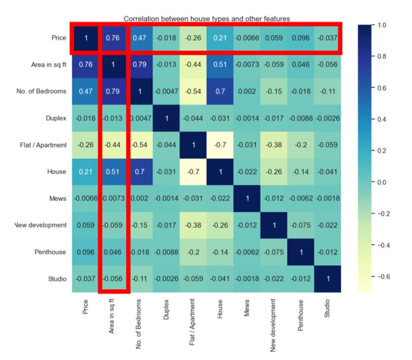
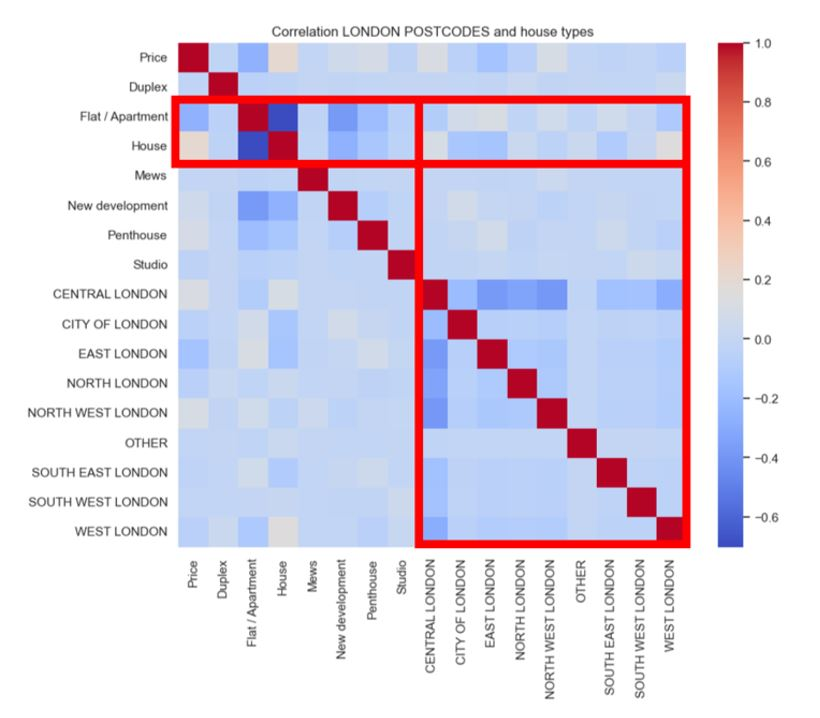
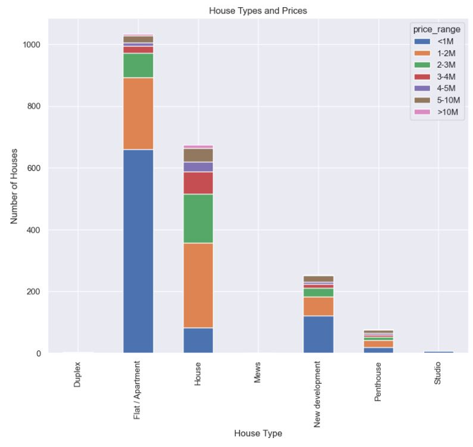
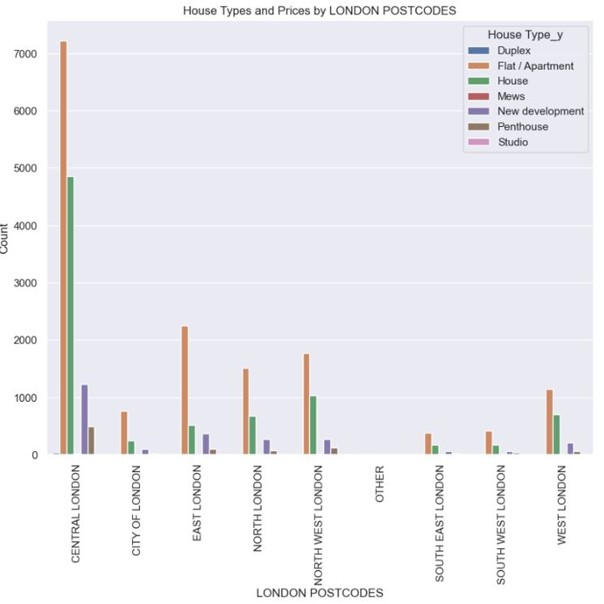
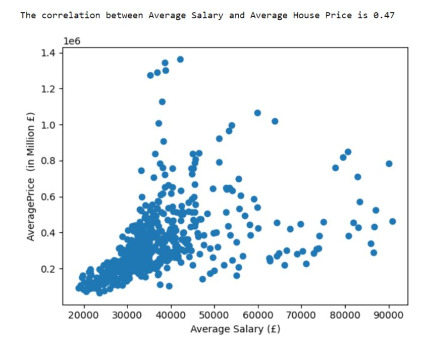
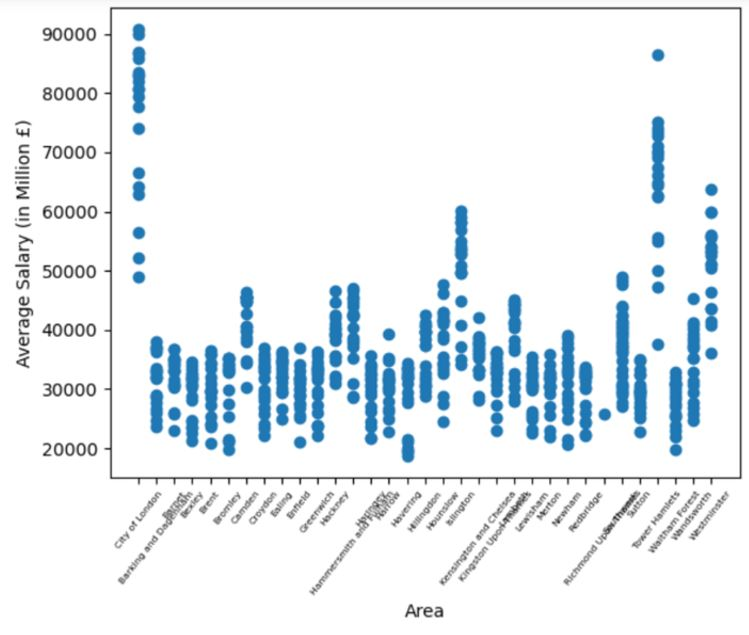

# Analysing House Prices In Different Boroughs In London 

Team Members -  Diego, Vera, Lewis, Prav, Hamim, Sultana

### Project Description/Outline:
Analysis of Property Prices In the different Boroughs In London and other influences on the property price.

### Research Questions:
1.   What are the most popular types of properties for sale in the London?
2.   What is the correlation between house prices and average salary in London? Which areas have a higher salary?
3.   How do property prices in London compare with other major cities in the UK over the last 25 years?
4.   What is the correlation between house prices and crime statistics?
5.   With the use of Apis, what are the correlation of average prices with certain amenities (Restaurants and Bars)?

### Findings

* In this heatmap, the main part to look at is the 'house type' and the other features. There isn't much of a correlation between these values as it is close to 0 indicating no correlation. However, we can see that as the 'area in sq. ft’ increases, the price increases. This is shown by the Pearson's r value of 0.76. This indicates a strong positive correlation.

* In this heatmap, the main part to look at is the 'London Postcodes' and the 'House Types'. There isn't much of a correlation between these values as it is close to 0 indicating no correlation. However, looking at the colours in the heatmap, the most common 'House Type' for each 'London Postcode' are houses and flats which is indicated by the 'beige' colour.

* In this bar chart we can see that 'flat/apartments' are mostly sold at a lower price compared to other 'House Types', which may influence why it is the most sold property in London.

* Central London has the highest population density compared to other 'London Postcodes' that's why it has the 'tallest' bar. Form this data we can see that for all 'London Postcode', flat/apartment are the most sold and it could be due to many reasons. One reason could be, due to London being the financial centre of England making it a highly desirable city to live in.

* In this chart each dot represents a London borough at an specific moment in time. The correlation coefficient of 0.47 that you see here indicates a moderate correlation between the Average House Price and the Average Salary. For instance, in this graph although we see in the bottom left corner a strong correlation between lower house prices and lower salaries, as salaries and house prices increase the correlation becomes weaker as we can see a bigger spreadas we move up towards the right of the graph. Meaning that that despite being in a low salary you might leave in an affluent borough.

* Here we see the average salary per borough. What stands out is how City of London, Southwark, Tower Hamlets and  Westminster are the London boroughs with the highest Average Salaries.

### Conclusion:
We looked at 33 boroughs, extrapolated it, and narrowed it down to the top and bottom five to give an idea of the most affluent and poorest boroughs. We discovered the following through our research:
1. According to the data we gathered, flats and apartments are the most common kind of property to live in, and square footage is the factor that has the biggest impact on how much a property is worth.
2. Central London has the highest population density compared to other 'London Postcodes.
3. The highest house prices are in following areas: Kensington and Chelsea, Westminster, Camden Hammersmith & Fulham, Richmond upon Thames, and Islington.
4. Where the crimes were at the highest, these were tourist areas.
5. House prices have increased almost 8 times the cost over the last 25 years.
6. Average salary did not correlate with the prices of the house. 

### Data Sets Used:
1. https://www.kaggle.com/datasets/arnavkulkarni/housing-prices-in-london
2. https://www.kaggle.com/datasets/justinas/housing-in-london
3. https://www.gov.uk/government/statistical-data-sets/uk-house-price-index-data-downloads-june-2020

### References:
https://www.youtube.com/watch?v=Wqmtf9SA_kk&t=1046s&ab_channel=NeuralNine

### Rough Breakdown of Tasks:
1. Data Collection: Identify and gather data sources, such as public sources, csv files and APIs. Then extract and clean the data.
2. Data Analysis: Explore and visualise the data to identify patterns and trends (produce 6–8 visualizations of data). Conduct statistical analyses such as finding mean, median and etc, to answer the research questions.
3. Location Analysis: Research and analyse different areas and boroughs in London and create matplotlib map.
4. Presentation: Create a presentation (on Powerpoint) summarising the findings and insights. Could create extra slides for appendix for more information.
