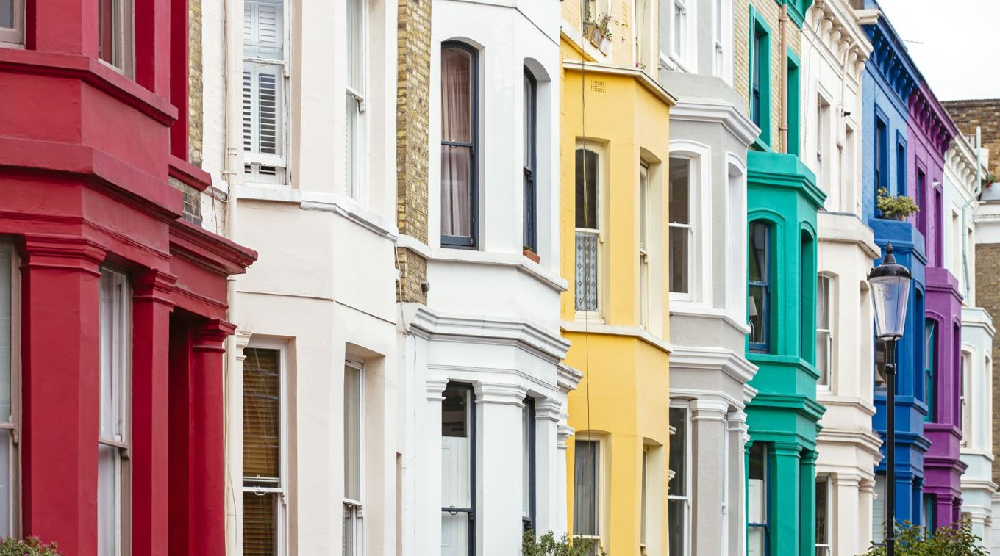
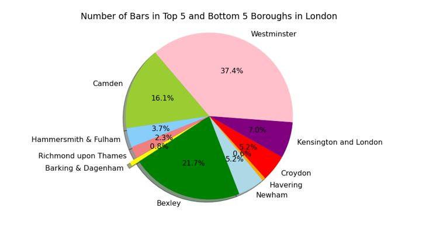

# Analysing House Prices In Different Boroughs In London 

Team Members -  Diego, Vera, Lewis, Prav, Hamim, Sultana

### Project Description/Outline:
Analysis of Property Prices In the different Boroughs In London and other influences on the property price.

### Research Questions:
1.   What are the most popular types of properties for sale in the London?
2.   What is the correlation between house prices and average salary in London? Which areas have a higher salary?
3.   How do property prices in London compare with other major cities in the UK over the last 25 years?
4.   What is the correlation between house prices and crime statistics?
5.   With the use of Apis, what are the correlation of average prices with certain amenities (Restaurants and Bars)?

### Findings

* In this heatmap, the main part to look at is the 'house type' and the other features. There isn't much of a correlation between these values as it is close to 0 indicating no correlation. However, we can see that as the 'area in sq. ft’ increases, the price increases. This is shown by the Pearson's r value of 0.76. This indicates a strong positive correlation.

* In this heatmap, the main part to look at is the 'London Postcodes' and the 'House Types'. There isn't much of a correlation between these values as it is close to 0 indicating no correlation. However, looking at the colours in the heatmap, the most common 'House Type' for each 'London Postcode' are houses and flats which is indicated by the 'beige' colour.

* In this bar chart we can see that 'flat/apartments' are mostly sold at a lower price compared to other 'House Types', which may influence why it is the most sold property in London.

* Central London has the highest population density compared to other 'London Postcodes' that's why it has the 'tallest' bar. Form this data we can see that for all 'London Postcode', flat/apartment are the most sold and it could be due to many reasons. One reason could be, due to London being the financial centre of England making it a highly desirable city to live in.

* In this chart each dot represents a London borough at an specific moment in time. The correlation coefficient of 0.47 that you see here indicates a moderate correlation between the Average House Price and the Average Salary. For instance, in this graph although we see in the bottom left corner a strong correlation between lower house prices and lower salaries, as salaries and house prices increase the correlation becomes weaker as we can see a bigger spread as we move up towards the right of the graph. Meaning that that despite being in a low salary you might leave in an affluent borough.

* Here we see the average salary per borough. What stands out is how City of London, Southwark, Tower Hamlets and  Westminster are the London boroughs with the highest Average Salaries.

* This graph shows the average salary in London in 2018 - the minimum is 31,990 which is in the London borough  Redbridge, the median is almost 37,000 and the max outlier shows what was mentioned in the previous slide that the London boroughs of City of London, Southwark, Tower Hamlets and Westminster.

* We looked in to how the average house price in London compared with other major cities over the last 25 years. Average house price in London has increased nearly 8 times its original price back in 1995. Other cities while they haven't seen the same level of growth, are now 5-6 times more expensive than what they were 25 years ago. There was a big dip in 2008/2009 due to the financial crisis but this rebounded within a year or two, more so in London to see the greatest rate of increase of average price.

* We then looked at the average price of different property types, and as to be expected the more desirable detached properties fetch a higher value than the semi-detached, terraced and flat types of properties. However, all 4 types of property have had a steady increase over the last 25 years.

* From the bar plot representing the average house price vs areas, we can see that the highest house prices are in following areas: Kensington and Chelsea Westminster Camden Hammersmith&Fullham Richmond upon Thames Islington.

* From the bar plot representing the number of crimes per area, we can observe a much higher number of crimes in Westminster, which is skewing the data. However, this is likely due to Westminster (and other high crime concentration areas) being a busy tourist spot. This explains the high amount of price.

* According to the correlation calculation and the scatter plot, we see a weak correlation between the average house price and the number of crimes. In the future research it may help to remove some of the city centre and tourist reas from the data to help understand this potential correlation better. The data is also not the most reliable as some areas were lacking in crime numbers or the crimes statistics was recorded poorly.

* With the use of Places API Playground we looked locating the number of fast food places and bars
* Focus was given to the bottom 5 boroughs by average house prices: (i) Barking & Dagenham (ii) Bexley (iii) Newham (iv) Havering (v) Croydon
* On analysis of the data it can be seen that Westminster is an outlier and skewing the data for both number of fast food placed and number of bars.
* Barking and Havering have the lowest figures for fast food places.
* Barking and Havering also show the lowest figures for fast food places.

* With the use of Places API Playground we looked locating the number of fast food places and bars
* Focus was given to the top 5 boroughs by average house prices: (i) Kensington & Chelsea (ii) Westminster (iii) Camden (iv) Hammersmith & Fulham (v) Richmond upon Thames
* On analysis of the data it can be seen that Westminster is an outlier and skewing the data for both number of fast food placed and number of bars.
* Hammersmith and Richmond show the lowest figures for bars.
* Kensington and Richmond show the lowest figures for fast food places

* Using the APIs package we were able to locate the number of bars and  fast food places in specific boroughs. The playground API was able to provide the numbers, coordinates and names of places for each borough specified.
* The data for number of fast food places showed that on average there were 164 places in the top 5 boroughs and 143 places in the bottom 5 boroughs, so not a significant difference.
* With the data for the number of bars in the boroughs, on average for the top 5 boroughs there were 64 and for the bottom 5 boroughs 32 bars. So, the boroughs with higher priced house on average,  had nearly double the number of bars.
* From the pie chart, it can be seen very clearly Kensington, Westminster and Camden have the most bars. This indicates that areas with higher prices show a trend of having more bars; this could be due to having a population with more disposable income attracting this type of business, or the higher frequency of bars could be attracting higher earners, thus increasing demand for property, causing an increase in price. The data is not conclusive for this and more data analysis would be required.

### Conclusion:
We looked at 33 boroughs, extrapolated it, and narrowed it down to the top and bottom five to give an idea of the most affluent and poorest boroughs. We discovered the following through our research:
1. According to the data we gathered, flats and apartments are the most common kind of property to live in, and square footage is the factor that has the biggest impact on how much a property is worth.
2. Central London has the highest population density compared to other 'London Postcodes.
3. The highest house prices are in following areas: Kensington and Chelsea, Westminster, Camden Hammersmith & Fulham, Richmond upon Thames, and Islington.
4. Where the crimes were at the highest, these were tourist areas.
5. House prices have increased almost 8 times the cost over the last 25 years.
6. Average salary did not correlate with the prices of the house. 

### Data Sets Used:
1. https://www.kaggle.com/datasets/arnavkulkarni/housing-prices-in-london
2. https://www.kaggle.com/datasets/justinas/housing-in-london
3. https://www.gov.uk/government/statistical-data-sets/uk-house-price-index-data-downloads-june-2020

### References:
https://www.youtube.com/watch?v=Wqmtf9SA_kk&t=1046s&ab_channel=NeuralNine

### Rough Breakdown of Tasks:
1. Data Collection: Identify and gather data sources, such as public sources, csv files and APIs. Then extract and clean the data.
2. Data Analysis: Explore and visualise the data to identify patterns and trends (produce 6–8 visualizations of data). Conduct statistical analyses such as finding mean, median and etc, to answer the research questions.
3. Location Analysis: Research and analyse different areas and boroughs in London and create matplotlib map.
4. Presentation: Create a presentation (on Powerpoint) summarising the findings and insights. Could create extra slides for appendix for more information.
